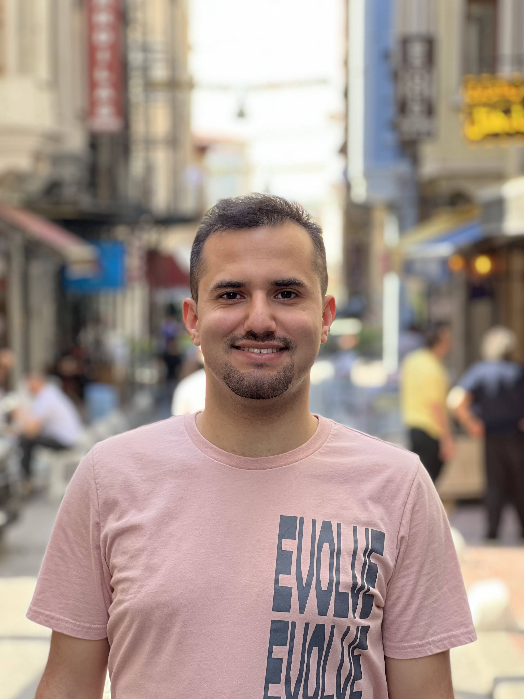

Abe joined the lab in 2025.

{: width="60%" }

abolfazl.arab@ucsf.edu

<a href="https://www.linkedin.com/in/abolfazlarab/" style="color:#1a73e8; text-decoration:underline;" target="_blank">LinkedIn</a>

Abolfazl “Abe” Arab is a graduate researcher in the Shokat Lab, where he study drugs targeting transcription factors and epigenetic regulators, with a focus on reactivating the p53 tumor suppressor in cancer. His work blends bioinformatics, chemical biology, and functional genomics to connect perturbations to cellular phenotypes. Before graduate school, Abe worked at Arc Institute and UCSF as researcher and studied Cellular and Molecular Biology B.Sc. at University of Tehran, Iran. Outside the lab, Abe enjoys biking and is especially nostalgic about long rides through the Zagros Mountains near his hometown of Shiraz.