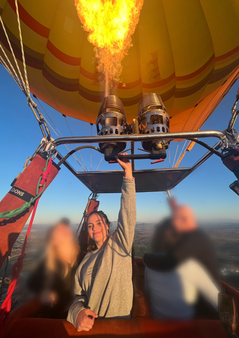

Vickie joined the lab in 2023.

{: width="60%" }

I am a graduate student in the Biomedical Sciences Program, and I am studying Rho GTPases, a class of G proteins crucial for cytoskeleton organization and cell migration. My research focuses on exploring the dysregulation of Rho GTPase signaling and its implications in the pathological progression of various diseases, including rheumatoid arthritis, neurodegenerative disorders, cardiac diseases, and cancer metastasis. I am passionate about developing innovative chemical tools to gain a deeper understanding of Rho GTPase signaling in both normal physiological processes and disease settings. Outside of lab, I enjoy hiking, traveling, trying to surf, beer, and my cats.
