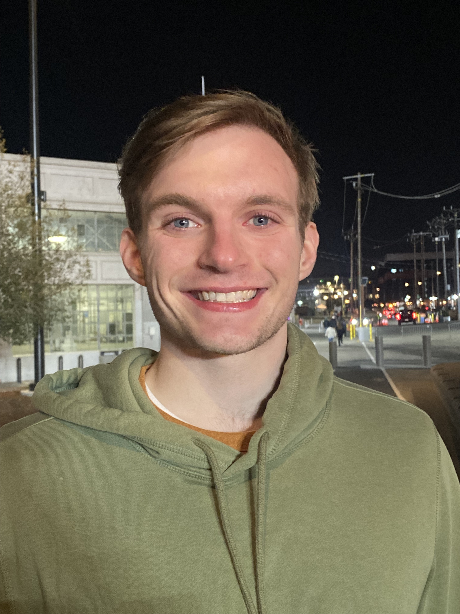

Hunter joined the lab in 2024.

{: width="60%" }

Hello! My name is Hunter and I am a graduate student in the Chemistry and Chemical Biology PhD program. I completed my undergraduate studies at the University of Illinois Urbana-Champaign, where I conducted research in Paul Hergenrother’s lab. My research interests focus on targeting the transcription and translation of oncogenic gene products, and I am currently designing small molecule inhibitors to achieve this goal. Outside of the lab, I enjoy exercising, playing video games, spending time outdoors, and losing (barely!) in trivia.
