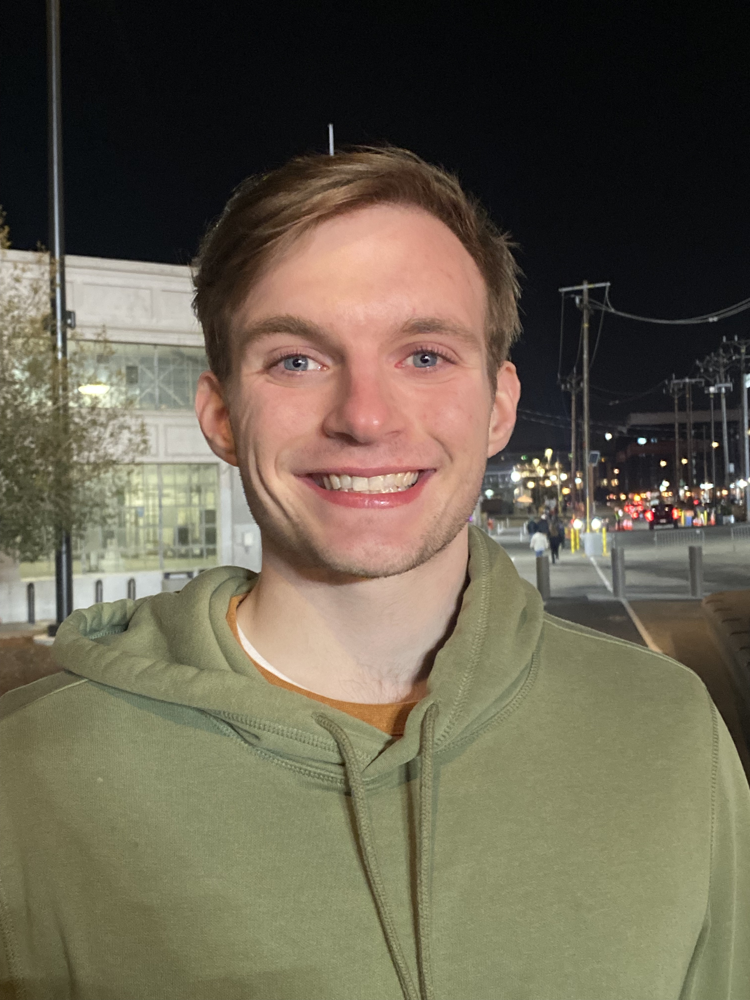

Hunter joined the lab in 2024.

{: width="60%" }

hunter.carrell@ucsf.edu

[LinkedIn ↗](https://www.linkedin.com/in/hunter-carrell-44b4b1221/)

Hello! My name is Hunter and I am a graduate student in the CCB program. My research in the Shokat Lab focuses on selectively drugging mRNA. Before graduate school, I attended the University of Illinois Urbana-Champaign and conducted research in Paul Hergenrother's Lab. Outside of the lab, I enjoy running, cycling, hiking, and video games.
