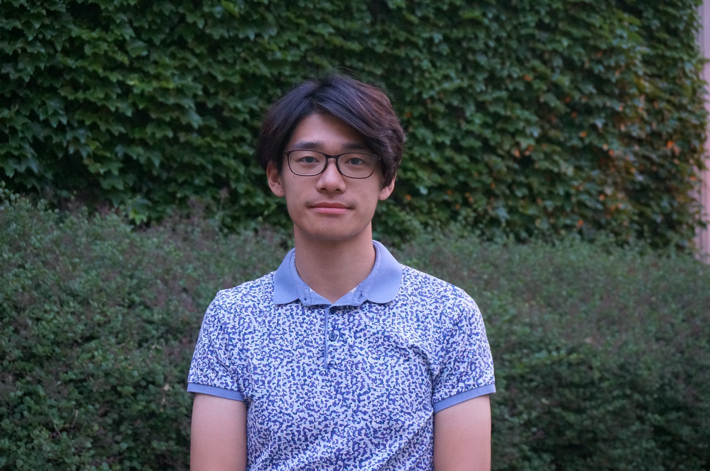

Changhao joined the lab in 2023.

{: width="60%" }

My research is centered on exploring the potential of small molecules as molecular glues to promote the presentation of neoantigens on the surface of tumor cells to induce strong adaptive immune responses. Specifically, I aim to design and evaluate the efficacy of antibody-based immunotherapies that target neoantigen-MHC complexes stabilized by molecular glues.
