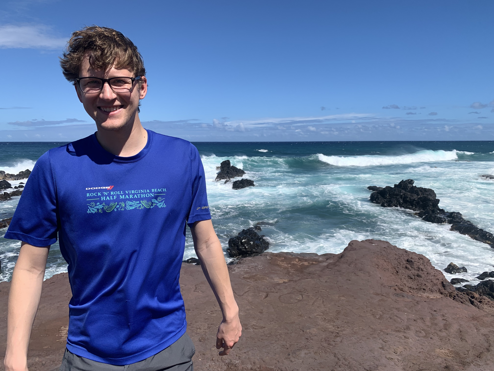

Josh joined the lab in 2023.

{: width="60%" }

I am exploring new methods of disrupting the Wnt/β-catenin signaling pathway.  Aberrant regulation of this pathway can lead to the activation of cyclin D1 and c-Myc, and is linked to multiple cancer types.  This work involves the synthesis and biological evaluation of novel chemical probes to selectively target cells that misregulate Wnt/β-catenin signaling.
