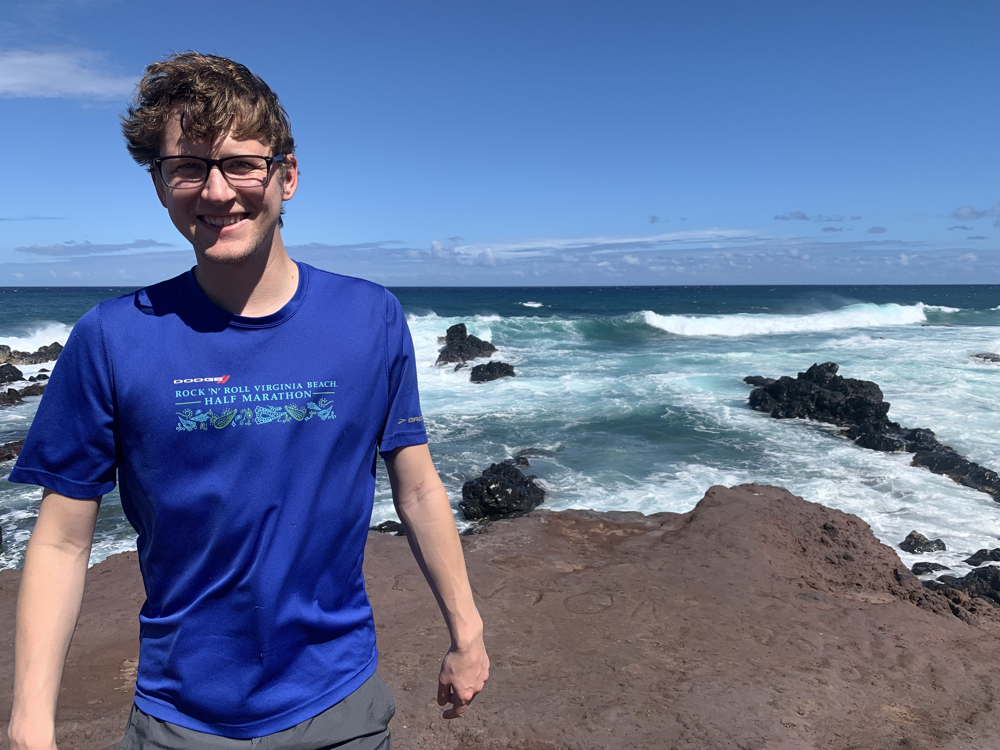

Josh joined the lab in 2023.

{: width="60%" }

joshua.combs@ucsf.edu

My research in the Shokat lab focuses on development and evaluation of bifunctional compounds for binary pharmacology. Prior to joining the Shokat lab I completed my PhD in Seth Herzon's lab at Yale University. When I am not doing research I enjoy playing soccer, spending time with my family, and spending time with friends.
