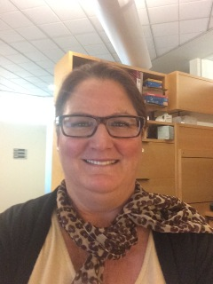

{: width="60%" }

A native New Yorker, I’ve been in California for 25 years now and call it home.  I have been in the academic/scientific sector since 2000 and feel proud supporting scientists’ efforts at groundbreaking discoveries!  I earned a B.S. in organizational behavior at USF and an M.A. in transpersonal psychology at ITP, in Palo Alto.  I get to apply all of these learned skills here in the Shokat lab and I am thrilled and grateful for the opportunity.  In my spare time I like reading, film, playing on the beach with my Havanese puppy, Belle, and let’s not forget my favorite past time– karaoke!
