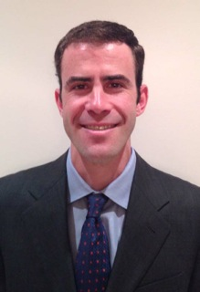

John joined the lab in 2012

As a medical oncologist who primarily treats liver cancer and other GI malignancies, my goal is to use chemical biology approaches to improve the treatment of cancer patients with kinase inhibitors. My primary effort has been to use activity-based proteomics for kinome profiling of a number of different cancers. I have focused primarily on biomarker discovery, but this effort has also led to the initiation of a drug development effort to re-activate tumor suppressor function to augment the effects of targeted therapy.