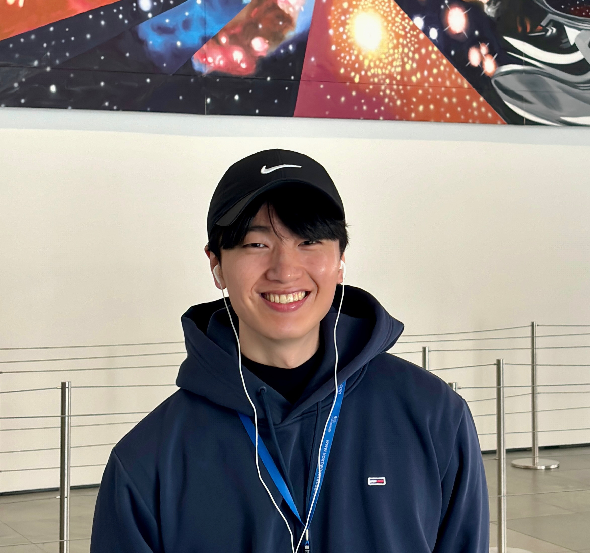

Sungwon joined the lab in 2025 (co-advised with Bill DeGrado).

{: width="60%" }

sungwon.jung@ucsf.edu

<a href="https://www.linkedin.com/in/sung-won-jung/" style="color:#1a73e8; text-decoration:underline;" target="_blank">LinkedIn</a>

Hi! I’m Sungwon, a graduate student in the Chemistry and Chemical Biology (CCB) program. My research focuses on combining small molecules with de novo proteins for chemical biology applications, with the long-term goal of enabling therapeutically relevant tools. Before joining UCSF, I lived in Seoul, South Korea, where I earned a PharmD and an MS in medicinal chemistry from Seoul National University. Outside the lab, I enjoy going to the gym, running, watching YouTube, and listening to music.