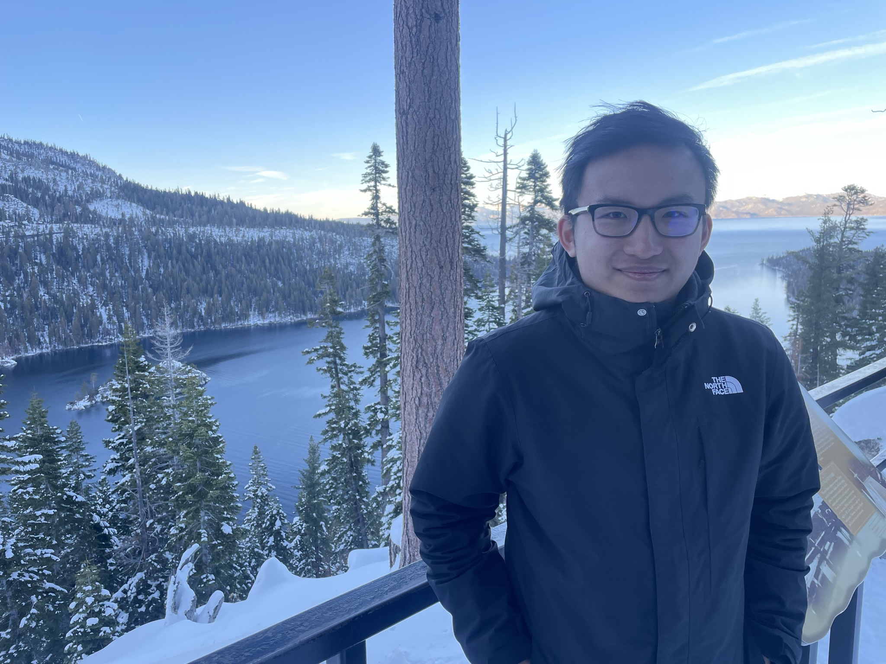

Sang joined the lab in 2024.

{: width="60%" }

I'm a graduate student in the Chemistry and Chemical Biology program. My research focuses on the kinases in the MAPK pathway, with a particular interest in drug resistance mediated by RAF inhibitor-induced paradoxical activation in KRAS-mutant cancers. Using chemical biology and chemical genetic-based approaches, I am interested in developing specific small molecule degraders of CRAF.
