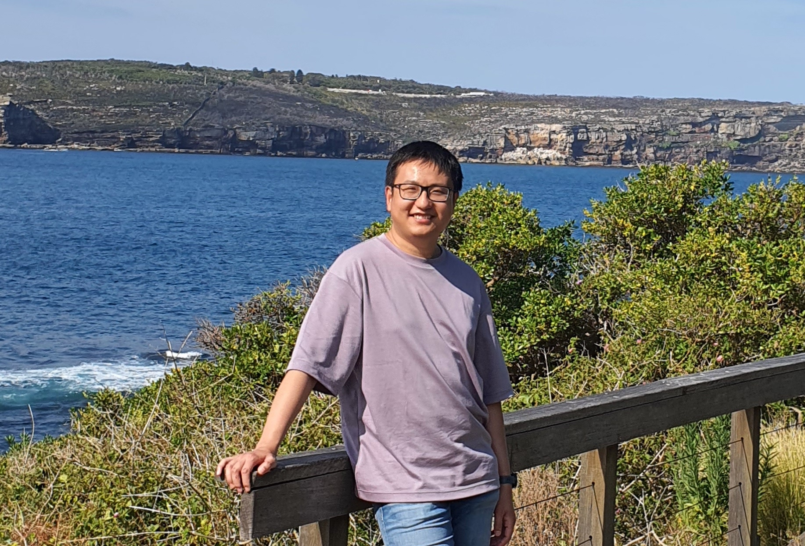

Jie joined the lab in 2023.

{: width="60%" }

My research focuses on the design, synthesis, and biological profiling of small molecules aimed at impairing transcription, translation, or protein-protein interactions. The primary goal is to discover modulators for “yet-to-be-drugged” targets, such as c-Myc and other transcription factors. I have a particular interest in utilizing chemical proteomics to reveal how small molecules rewire cancer pathways, thereby providing insights for potential combination therapies in clinic. 
