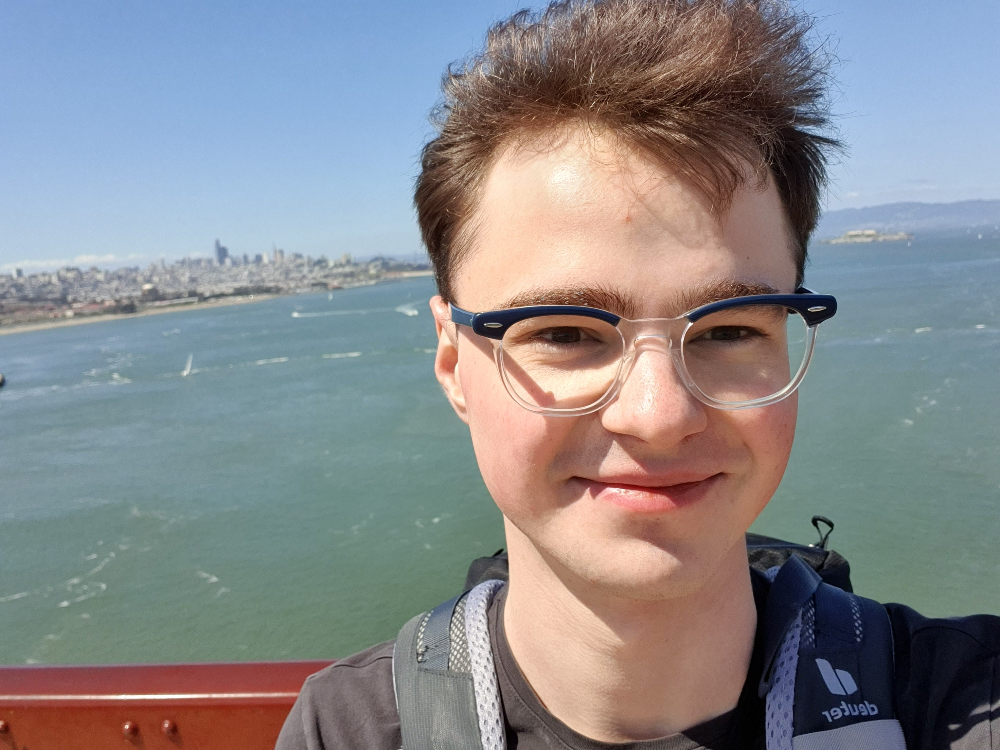

Julius joined the lab in 2023.

{: width="60%" }

I am a master's student of biochemistry at Heidelberg University in Germany. My one-year thesis project focuses on the development of novel covalent inhibitors for K-Ras. My project is at the interface between chemical biology and medicinal chemistry and involves the synthesis of small molecule inhibitors as well as their characterization in vitro and in cells. We hope that this work could increase the number of patients benefiting from Ras targeting drugs.
