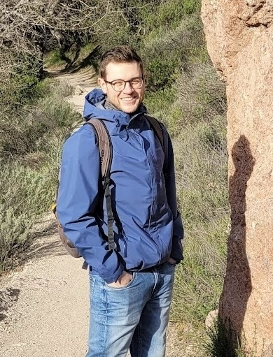

Patrick joined the lab in 2023.

{: width="60%" }

The main subject of my research is the retinoblastoma-associated protein (Rb). Rb is often referred to as a prototypical tumor suppressor as its tight interaction with E2F transcription factors controls passage through the G1/S restriction point of the cell cycle. In proliferating cells, the Rb-E2F interaction is disrupted as Rb becomes increasingly phosphorylated, which is a process mediated by cyclin-dependent kinases (CDKs). In many types of cancer with amplified CDK activity Rb is functionally inactivated, which leads to unimpeded cell growth. My current goal is to identify and leverage chemical strategies for reactivation of Rb and its tumor-suppressive functions in cancer cells.
