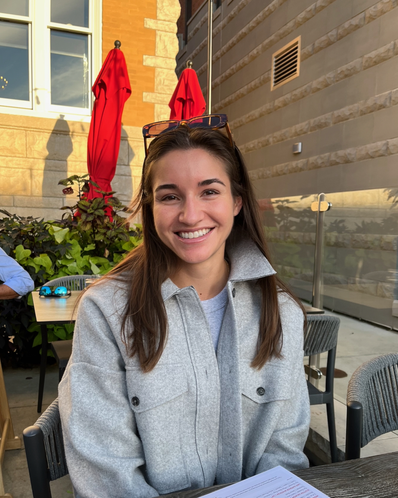

Rachel joined the lab in 2024.

{: width="60%" }

I’m a graduate student in the Biomedical Sciences Program, and my research focuses on a unique family of multi-domain GTPases called Roco proteins. I’m particularly interested in LRRK2 and LRRK1, which are implicated in Parkinson’s Disease and bone biology, respectively. Using chemical genetics approaches, I hope to gain a deeper understanding of how to perturb LRRK2 and LRRK1 to restore normal signaling in the setting of disease.
