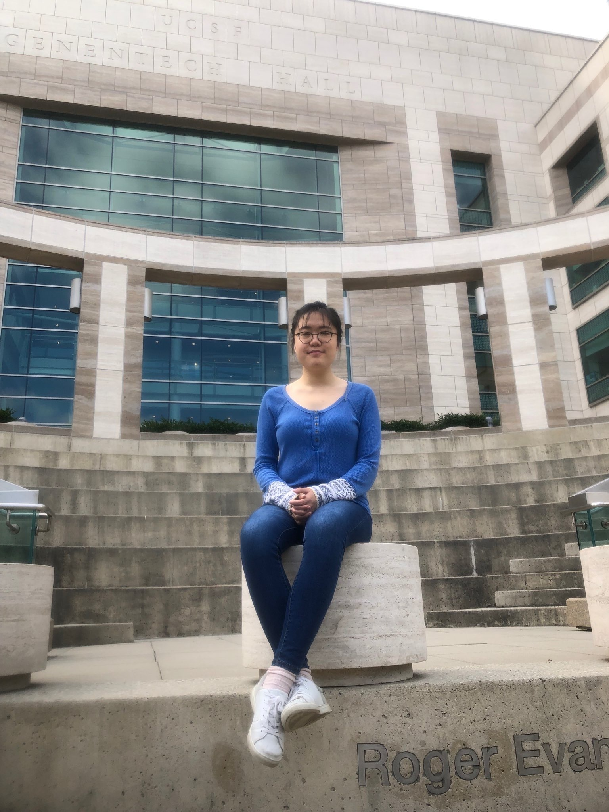

Ying joined the lab in 2018.

I am studying PIP5K1A, an essential enzyme  in mediating membrane trafficking and a key host factor mediating replication of RNA viruses. I am also interested in developing small molecules to specifically inhibit PIP5K1A, defining its cellular roles and developing antiviral therapeutics.
