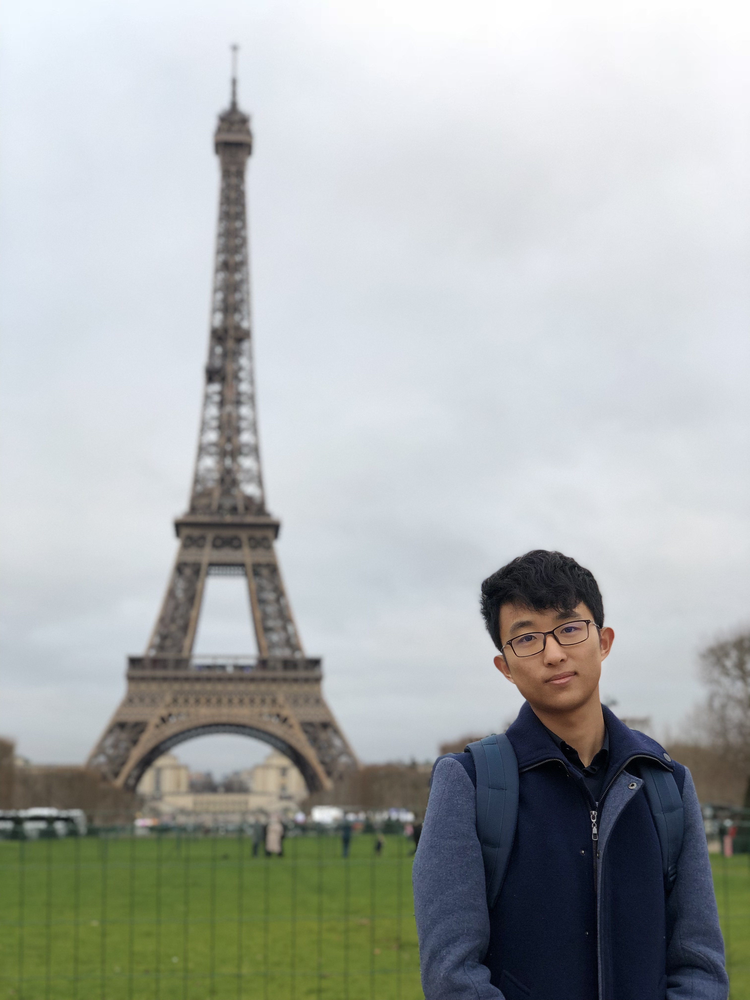

Dai joined the lab in 2017.

{: width="60%" }

I am a graduate student in the Chemistry and Chemical Biology program. My research focuses on targeting the oncogene MYC. MYC is deregulated in approximately 70% of human cancers and is also widely considered ‘undruggable’. I am particularly interested in finding small molecules that can disrupt the interactions between Myc protein and its associated proteins.
