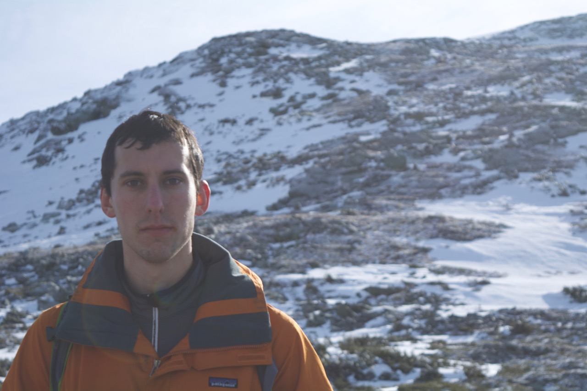

Jack joined the lab in 2018.

{: width="60%" }

I’m a graduate student in the Chemistry and Chemical Biology program. My research focuses on CDK4, a cyclin-dependent kinase that controls entry into the cell cycle. CDK4 exists in various complexes in cells, and I am using covalent probes, among other methods, to discover the functional roles of these complexes with implications both for fundamental cell biology and for cancer therapy.
