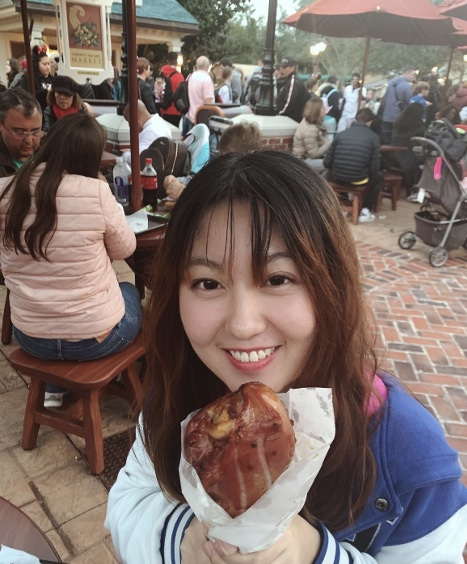

Siyi joined the lab in 2021.

I’m a graduate student in the Chemistry and Chemical Biology program. My work focuses on selectively regulate RNA translation on a 5’UTR targeting approach. The targets I’m particularly interested in, among many others, are the oncogenes and virus RNA.
