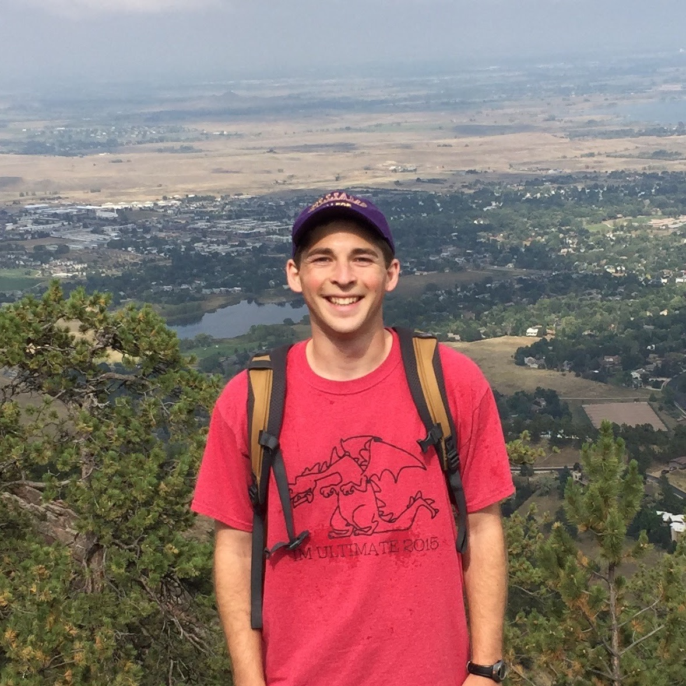

Douglas joined the lab in 2017

I am a graduate student in the Chemistry and Chemical Biology program. My research centers around mTOR, a protein kinase that regulates many processes in cell growth. By modifying rapamycin, a natural product inhibitor of mTOR, I aim to develop new chemical probes that will further our understanding of mTOR’s complex signaling network and provide insight into mTOR’s role in diseases such as cancer and neurodegeneration.
