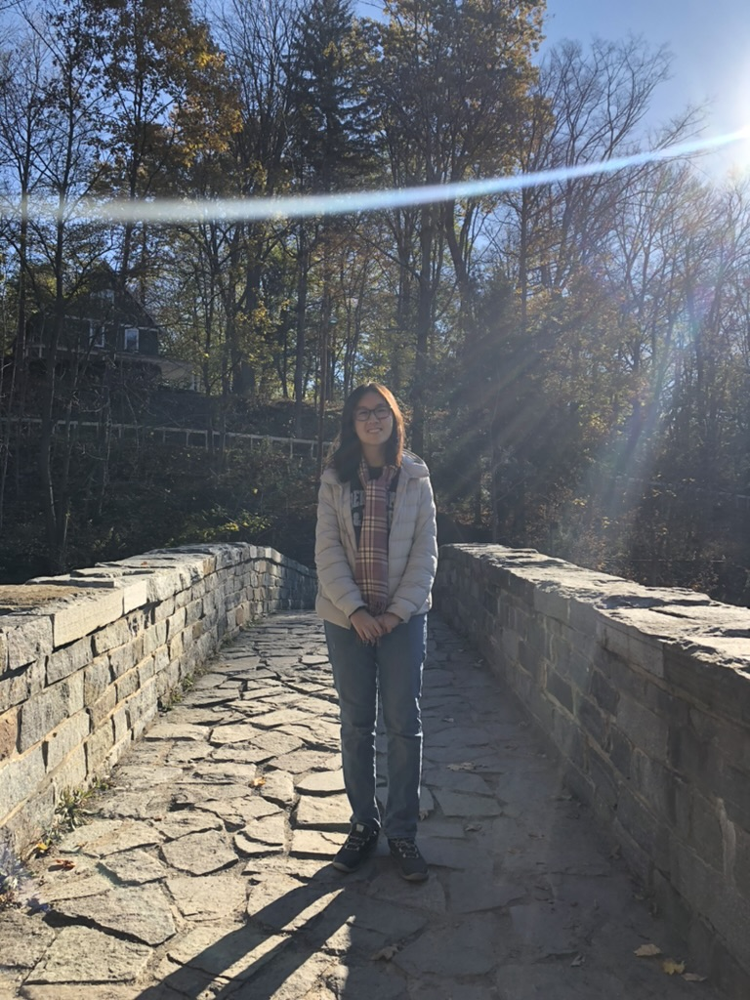

Megan joined the lab in 2026 (co-advised with Kevin Lou).

{: width="60%" }

megan.xu@ucsf.edu

<a href="https://www.linkedin.com/in/meganx123/" style="color:#1a73e8; text-decoration:underline;" target="_blank">LinkedIn</a>

Hi! My name is Megan, and I am a student in the Tetrad PhD program. My research focuses on targeting mutant kinases in cancer. Before UCSF, I was got a B.A. in Chemistry and Biology at Cornell University. There, I studied allosteric sites in K-Ras using room temperature crystallography. Outside of lab, I enjoy running, drawing, and playing piano.
