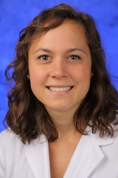

Adri joined the lab in 2017

I am a HHMI Medical Research Fellow studying the structure and function of PCSK9, a critical protein in the development of atherosclerosis. We hope to better understand the processing of PCSK9 in order to develop targeted therapies for heart disease through small molecule inhibitors.
