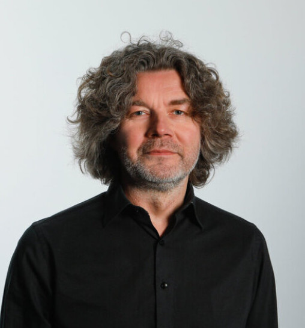

Harri joined the lab in 2022.

{: width="60%" }

I am a visiting scholar from the Detection Technology Group at the University of Turku in Finland, where I am a University Lecturer in Materials Chemistry (more info <a href="https://sites.utu.fi/reagentanalytics/people/">here<a>). I specialize in simple, inexpensive, user-friendly assays for protein-ligand binding, often using lanthanide luminescence. In the Shokat lab I'm focusing on G&alpha; and p53.