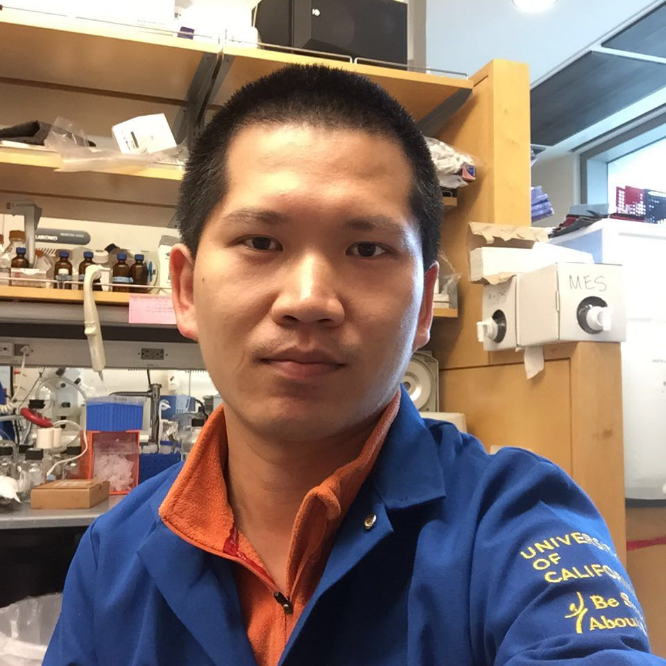

Qi joined the lab in 2017

I'm studying the cancer-causing mutations in GNAS, the gene that encodes the α subunit of the stimulatory G protein (Gαs). Activating mutations of GNAS have been revealed to contribute to progression and metastasis of several kinds of cancers. About 64% of these mutations result in a single variant called R201C, which keeps Gαs in a constitutively active state. I'm trying to fully understand the effect of this mutation on the activity of Gαs. I'm also interested in  developing small molecules to specifically inhibit the R201C mutant protein.
