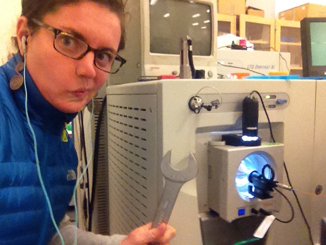

Becca joined the lab in 2011. 

She is a graduate student from the Chemistry and Chemical Biology program. She is working on mass-spectrometry proteomics based methods for probing kinases at the kinase-substrate, kinase pathway and whole kinome levels. 