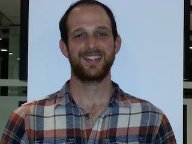

Steven joined the lab in 2016. 

My research focuses on understanding host-pathogen biology by probing substrate partners of various eukaryotic-like serene/threonine kinases that are expressed as bacterial effector proteins. Using Legionella pneumophila as a model system, I am taking the analog-sensitive kinase approach developed by the lab to understand the substrates of L. pneumophila’s effector kinases. We hope to validate the functionality of an discovered phosphosites in the context of bacterial infection.
