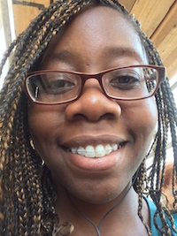

Chimno joined the lab in 2014. 

I am invested in creating targeted therapies for common oncogenes, especially Ras.  To further investigate the druggability of Ras, I am utilizing a multipronged approach to design covalent inhibitors that can be used to probe the chemical biology of Ras-driven cancer cell lines.