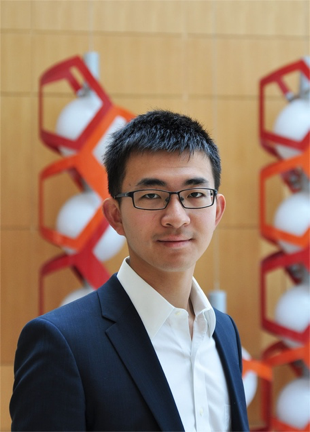

Ziyang joined the lab in 2016.

{: width="60%" }

My research aims to develop new mechanism-based therapeutic agents through the understanding and exploitation of chemical reactivity. In doing so, I am particularly interested in finding small molecules that can disrupt or strengthen protein-protein interactions. Currently, my research is focused on exploring strategies to covalently target aspartate, glutamate, and arginine residues, with the goal of developing small-molecule inhibitors specific to oncogenic mutants of Ras.
